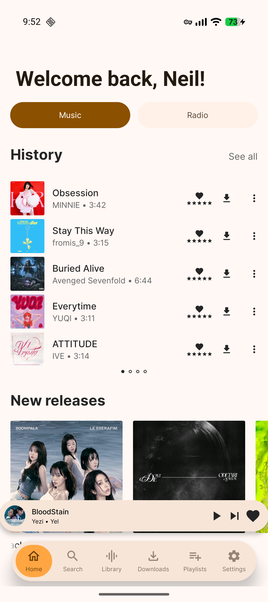
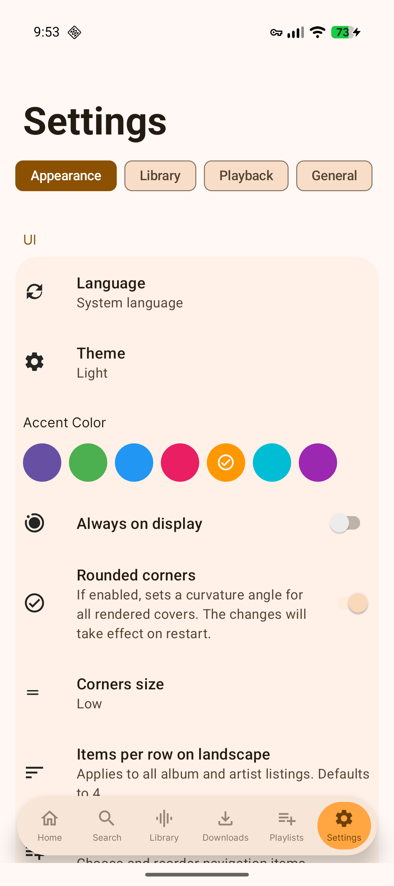
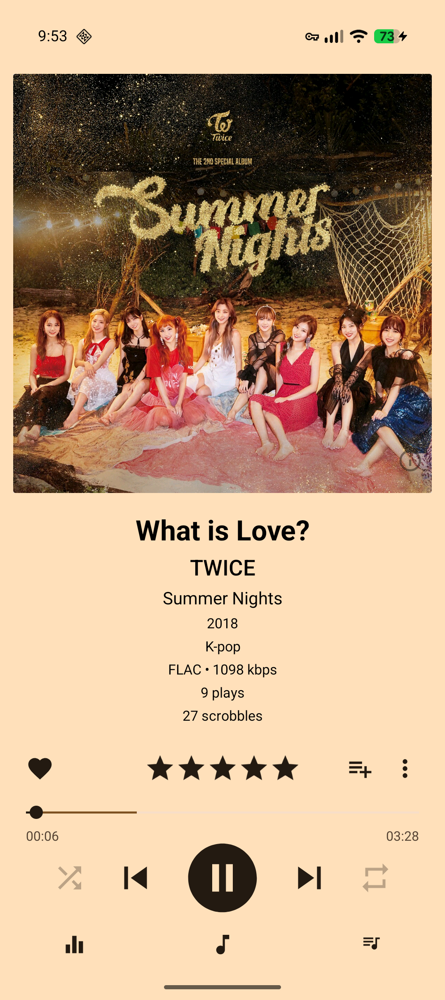
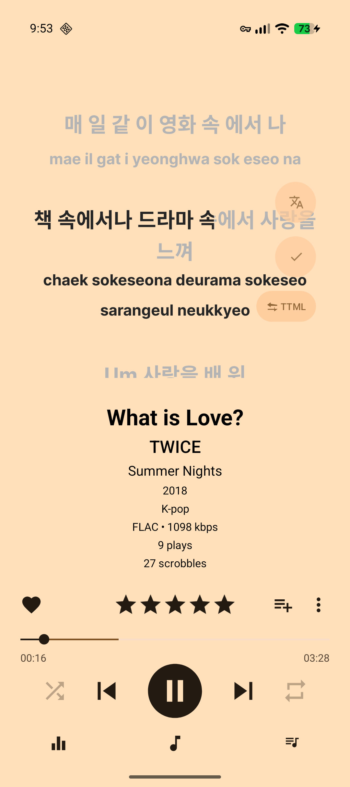

<h1 align="center">Rollynn</h1>

---

  <b>Rollynn - Subsonic music client for Android</b>

Rollynn is an open source, native Android Subsonic client focused on practical playback, stable syncing, and a polished player experience. It is a fork of the Tempus app with significant UI changes and added features.

## Screenshots

  
  
  
  

## What makes Rollynn different from Tempus:

### New features
- Last.fm scrobble counts on the now-playing screen.
- Playlist improvements: multi-playlist selection, persistent pinning, real-time sync across tabs, client-side sorting, and inline track removal.
- Home screen additions: "Recently Played" and "Top Played" sections for artists and songs, plus a clearer History section.
- Player improvements: sequential Play Next, searchable playlist chooser with direct Add to Playlist action, configurable metadata display, and scrobble-threshold setting.
- Artist page redesign with categorized album carousels, circular similar artists, and improved top-songs layout.
- LRCLIB lyrics integration with synced LRC parsing support and source switching.
- Player metadata typography system (`Title` / `Artist` / `Album` / `Secondary`) with screen-size-aware sizing.
- Accent-aware player background color utility and system-bar color helpers.
- Offline search for downloaded songs.
- Server unreachable banner on Home screen.
- Lyrics romanization for multiple languages
- Lyrics translation via DeepL and OpenAI-compatible APIs
- Word-by-word synced lyrics support
- Karaoke-style wipe animation
- Nested playlist folders
- Multi-select batch playlist moves
- Pinned playlist priority ordering
- Bulk playlist download removal
- Playlist download state indicators
- Overall and per-track download progress UI
- Automatic hourly playlist sync

### UI and UX
- Rebrand from Tempus to **Rollynn** across app name, client name, user-agent strings, and localized strings.
- Pill-shaped navigation dock.
- Redesigned settings with card layout and pill-tab navigation.
- Polished mini-player and circular artist images.
- Search moved from toolbar to navigation dock.
- Toolbar overflow menu removed from Library/Downloads; settings accessible from dock.
- Added Track Info action in song context menu (3-dot menu).
- Refined player spacing and hierarchy: larger album art, reduced art-to-metadata gap, increased metadata-to-rating spacing, increased controls-to-lyrics spacing, and adjusted play-controls vertical alignment.
- Updated player info button behavior: moved closer to album-art bottom-right and shown only on album-art page (hidden on lyrics page).
- Home section updates: Starred Tracks now shows a random sample of 20 tracks; Latest Releases is now a horizontal album carousel with larger aligned cover sizing.
- Downloads filter bar with live filtering
- Grid/list toggle for album and artist catalogues

### Security and privacy
- Credentials (password, token, salt, Last.fm API key) moved to encrypted preferences (`AES256-GCM`) with auto-migration from plaintext.
- Input validation added to album-art content provider (path traversal/invalid ID protection).
- ProGuard hardening: source filenames stripped from release stack traces.
- OkHttp logging interceptor moved from alpha to stable `4.12.0`.
- Last.fm API key persistence fixed via secure fallback + auto-migration.

### Performance and system behavior
- Large-list scrolling improved by fixing RecyclerView view recycling (`getItemViewType()` issue).
- Reduced bind overhead by caching star-rating drawables and download-tracker lookups.
- Replaced broad `notifyDataSetChanged()` refreshes with `DiffUtil`-based targeted updates.
- Offline scrobble syncing with original timestamps.
- Real-time propagation of favorites, ratings, and play counts across screens.
- Home startup reliability fixes for History and Top Played sections.
- Improved Navidrome-backed Home request/auth reliability.
- Reorganize button on Home now appears immediately.
- Album page now scrolls as a single consistent surface.
- Fixed album page blank/cut-off region near mini-player/navigation dock.
- Improved Starred Tracks loading responsiveness by reducing cover-art request stalls.
- Last Played albums now refresh automatically after scrobble events.

### Player and visual fixes
- Player theme consistency fixes: player background follows selected accent/theme behavior, and status/navigation bars sync correctly with player and app state.
- Player text color fixes: metadata text now uses black in light mode and white in dark mode (instead of accent color).
- Visual artifact fixes: removed top seam/white-line issue at player start and removed collapsed mini-player background bleed.
- Fixed unstable Starred Tracks rendering (section disappearing/intermittent population).
- Artist image loading reliability fixes: Glide timeout increased from `1200ms` to `8000ms`, and failed-request suppression cache removed so retries can occur.
- Added null-safety guards in song-list and Home observers for more stable updates.
- Cleaned up player bottom-sheet expanded/collapsed transition behavior.

## Core features inherited from Tempus/Tempo lineage

- Subsonic/OpenSubsonic library browsing and playback
- Search, playlists, radio, podcasts (server capability dependent)
- Gapless playback and transcoding controls
- Optional scrobbling integrations
- Offline downloads and lyrics download support
- Android widget support
- Multi-language support

## Credits

Rollynn is built on top of two upstream open source projects:

- **Tempus** by [@eddyizm](https://github.com/eddyizm)  
  Repository: https://github.com/eddyizm/tempus
- **Tempo** by [@CappielloAntonio](https://github.com/CappielloAntonio)  
  Repository: https://github.com/CappielloAntonio/tempo

Thanks to all contributors from Tempus and Tempo.

The lyrics work in Rollynn (romanization and translation) was significantly inspired by the **Metrolist** project, which served as a major reference for these features. https://github.com/MetrolistGroup/Metrolist

- **LRCLIB** — plain and synced (LRC) lyrics. https://lrclib.net
- **Better Lyrics** — TTML word-by-word synced lyrics. https://github.com/boidushya/better-lyrics
- **Last.fm** — scrobble counts and artist/album metadata. https://www.last.fm

### Translation providers

Lyrics translation is performed by user-configured third-party services:

- **DeepL** — https://www.deepl.com
- **OpenAI-compatible** chat APIs, including [OpenRouter](https://openrouter.ai) and [Mistral](https://mistral.ai).

### Notable libraries

- **Kuromoji** (`kuromoji-ipadic`, Apache-2.0) — Japanese morphological analysis for romanization, bundling the **IPADIC** dictionary (© Nara Institute of Science and Technology). https://github.com/atilika/kuromoji
- **ICU** (`android.icu`) — Han-to-Latin transliteration for Chinese romanization. https://icu.unicode.org

## Contributing

PRs are welcome. Please include:
- a clear description of the change
- build verification details
- before/after screenshots or short videos for UI updates

## License

Rollynn is released under the [GNU General Public License v3.0](LICENSE).
